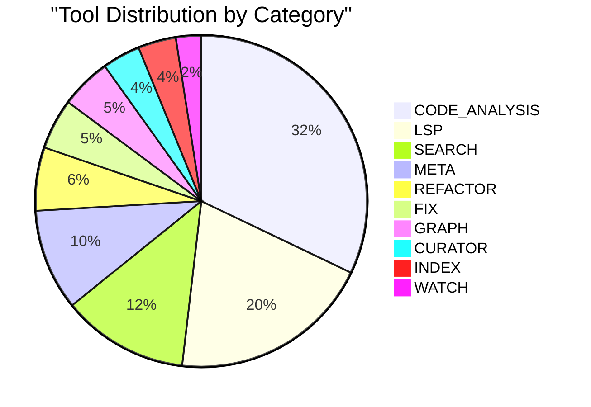
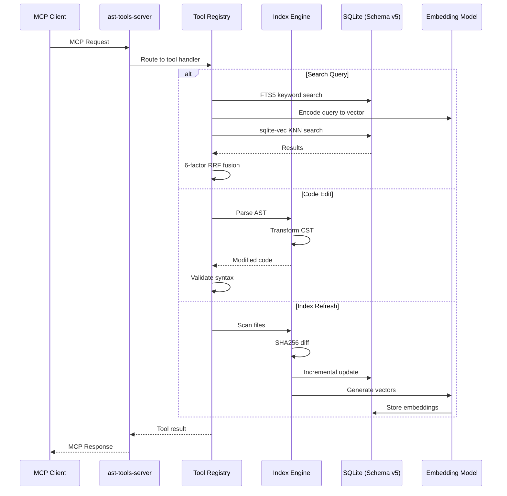
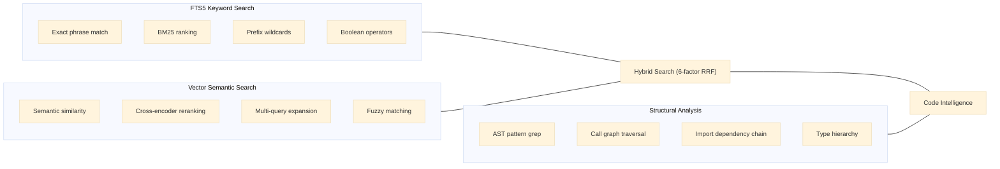
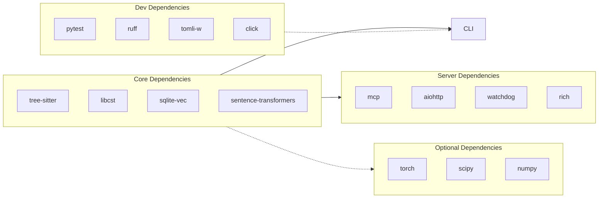
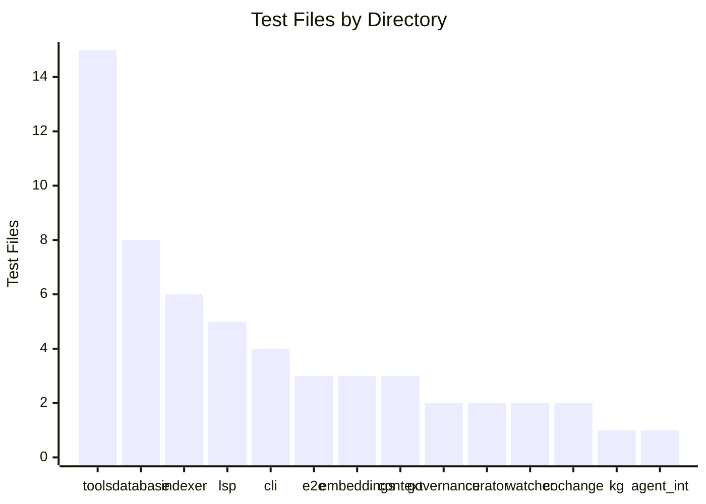

# rw-ast-tools Codebase Map

**Generated:** 2026-07-31  
**Version:** v0.2.0  
**Tools:** 77 MCP tools across 10 categories  
**Source files:** 134 Python files (5,215 lines)  
**Test files:** 71 (8,946 lines) — 943 passing, 2 skipped  
**Schema:** v5 (symbols, embeddings, edges, dependency metrics, KNN graph, audit log)

---

## Project Overview

rw-ast-tools is an MCP server providing structural code analysis and editing capabilities. It uses tree-sitter for multi-language parsing, sqlite-vec for hybrid semantic + keyword search with 6-factor RRF fusion, and libcst/tree-sitter for surgical code editing.

### Architecture Diagram

```mermaid
graph TB
    subgraph CLIENTS["Client Layer"]
        A[Hermes Agent]
        B[Claude Code]
        C[FORGE]
        D[Any MCP Client]
        E[Terminal CLI]
    end

    subgraph SERVER["Server Layer"]
        F["ast-tools-server (3 modes)"]
        FA["timeout mode<br/>(stdio + idle TTL)"]
        FB["daemon mode<br/>(systemd + watcher)"]
        FC["remote mode<br/>(Streamable HTTP)"]
        F --> FA
        F --> FB
        F --> FC
    end

    subgraph PLUGINS["Hermes Plugins"]
        G[ast-tools-context]
        H[ast-tools-tokens]
        I[ast-tools-project-context]
    end

    subgraph TOOLS["MCP Tool Layer (77 tools)"]
        J[CODE_ANALYSIS<br/>25 tools]
        K[SEARCH<br/>10 tools]
        L[LSP<br/>13 tools]
        M[REFACTOR<br/>5 tools]
        N[META<br/>8 tools]
        O[CURATOR<br/>3 tools]
        P[FIX<br/>4 tools]
        Q[GRAPH<br/>4 tools]
        R[INDEX<br/>3 tools]
        S[WATCH<br/>2 tools]
    end

    subgraph AGENT["Agent Integration"]
        T[context_builder]
        U[token_tracker]
        V[error_correction]
        W[session_intel]
    end

    subgraph CORE["Core Engine"]
        X[Indexer<br/>extractor, diff, parser]
        Y[Database<br/>schema v5, queries]
        Z[Embeddings<br/>model, store, provider]
        AA[Knowledge Graph<br/>graph_engine]
        AB[Co-Change Analysis<br/>git_miner, hotspot]
        AC[Fix Engine<br/>fixers, engine, config]
        AD[Reranker<br/>cross-encoder]
        AE[Spectral Clustering<br/>tool discovery]
    end

    subgraph INFRA["Infrastructure"]
        AF[Watcher Daemon]
        AG[Watchdog Monitor]
        AH[Curator<br/>cleanup, doctor, pii]
        AI[Governance<br/>scanner, differ, reporter]
    end

    subgraph UTILS["Utilities"]
        AJ[Security<br/>validation, sanitizer]
        AK[File Utils]
        AL[RRF Fusion]
        AM[Config System]
    end

    CLIENTS --> SERVER
    CLIENTS -.-> PLUGINS
    PLUGINS --> SERVER
    SERVER --> TOOLS
    TOOLS --> AGENT
    AGENT --> CORE
    CORE --> INFRA
    INFRA --> UTILS
    CORE --> UTILS
```



---

## Package Architecture

### Layer 0: MCP Tools (`src/ast_tools/tools/`) — 42 source files

The largest package, containing all 77 MCP tool implementations.

| Category | Tools | Count |
|----------|-------|-------|
| **CODE_ANALYSIS** | `ast_grep`, `ast_read`, `ast_query`, `ast_capsule`, `ast_generate_stub`, `code_validate_syntax`, `codebase_summary`, `repo_skeleton`, `project_info`, `module_imports`, `structural_analysis`, `impact_analysis`, `blast_radius_v2`, `class_hierarchy`, `dead_code_detection`, `dead_code_enhanced`, `transitive_dependents`, `circular_dependencies`, `dependency_chain`, `external_dependencies`, `api_surface_diff`, `co_change_diff`, `co_change_history`, `co_change_hotspots`, `co_change_predict`, `suggest_modules` | **26** |
| **SEARCH** | `semantic_search`, `search_symbols`, `find_references`, `find_symbol_definition`, `list_symbols`, `file_related_suggest`, `rerank_results`, `list_embedding_models`, `switch_embedding_model`, `get_embedding_model_info` | **10** |
| **LSP** | `lsp_definition`, `lsp_references`, `lsp_hover`, `lsp_symbols`, `lsp_call_hierarchy_in`, `lsp_call_hierarchy_out`, `lsp_diagnostics`, `lsp_format`, `lsp_code_actions`, `lsp_rename`, `lsp_signature_help`, `lsp_workspace_symbols`, `lsp_completion`, `lsp_completion_detail`, `lsp_available_languages`, `lsp_check_server` | **16** |
| **REFACTOR** | `ast_edit`, `ast_refactor_extract_interface`, `ts_edit` (plus LSP rename/code_actions) | **5** |
| **META** | `search_tools`, `call_tool`, `tool_info`, `tool_usage_stats`, `context_inject`, `context_status`, `token_status`, `validate_usage` | **8** |
| **CURATOR** | `curator_audit`, `curator_status`, `curator_summary` | **3** |
| **FIX** | `fix_code`, `fix_check`, `llm_suggest_fix`, `lsp_format` | **4** |
| **GRAPH** | `kg_query`, `kg_neighborhood`, `kg_shortest_path`, `class_hierarchy` | **4** |
| **INDEX** | `refresh_index`, `reindex_path`, `index_status` | **3** |
| **WATCH** | `watch_add`, `watch_status` | **2** |



### Layer 1: Index Engine (`src/ast_tools/indexer/`) — 8 files

Parses source code, extracts symbols, computes dependency metrics, builds KNN graphs, and handles incremental diff updates.

```
File                        Lines  Purpose
──────────────────────────────────────────────────
__init__.py                    19  Package exports
parser.py                     168  Tree-sitter parsing
extractor.py                  698  Symbol extraction from ASTs
diff.py                       182  Symbol-level diff engine (added/removed/modified)
cache.py                      310  SHA256 content-hash cache for incremental indexing
dependency_metrics.py         282  Fan-in/fan-out, centrality, SPOF detection
knn_builder.py                288  K-nearest-neighbor graph construction
implements_detector.py        219  Interface/protocol implementation detection
```

### Layer 2: Database (`src/ast_tools/database/`) — 4 files

Schema v5: symbols, embeddings (384-dim), edges, dependency_metrics, knn_graph, audit_log. Uses FTS5 + sqlite-vec.

```
database/
├── __init__.py      53 lines  Async connection helpers
├── connection.py   215 lines  SQLite connection management
├── schema.py       333 lines  Schema v5 definitions + migrations
├── queries.py      819 lines  All query functions (FTS5, vector, RRF, etc.)
└── migrations/
    └── migration_009.py  200 lines  Schema enrichment migration
```

### Layer 2: Embeddings (`src/ast_tools/embeddings/`) — 6 files

384-dim vector embeddings via sentence-transformers (bge-small-en-v1.5). CPU-only, lazy-loaded.

### Layer 3: Knowledge Graph (`src/ast_tools/kg/`) — 2 files

Graph-based code analysis: shortest path, neighborhood, dependency chains.

### Layer 3: Co-Change Analysis (`src/ast_tools/cochange/`) — 2 files

Git-based co-change mining: change prediction, hotspot detection, history analysis.

### Layer 3: Fix Engine (`src/ast_tools/fix/`) — 4 files

Multi-language convergent fix pipeline: Python (Ruff), TypeScript (ESLint), Go, Rust, C++, Markdown.

### Layer 4: Integration

- `agent_integration/` — Zero-dependency agent modules (context builder, token tracker)
- `lsp/` — Language Server Protocol server and client implementations
- `hermes-plugins/` — Hermes Agent plugins (context, tokens, project-context)

### Layer 5: Infrastructure

- `watcher/` — File watcher daemon with 100ms debounce
- `watchdog/` — Metrics store and monitoring
- `curator/` — Automated index curation, doctor, PII detection
- `governance/` — Code governance scanning, diff, reporting

---

## Data Flow



---

## Venn Diagram: Search Capabilities



---

## Server Modes

| Mode | Transport | Lifecycle | Use Case |
|------|-----------|-----------|----------|
| **timeout** (default) | stdio | Per-connection, idle TTL | Desktop CLI agents, ad-hoc queries |
| **daemon** | stdio + systemd | Persistent, auto-restart, watcher | Multi-agent workstations, continuous indexing |
| **remote** | Streamable HTTP | Persistent, auth, multi-client | Server deployment, team usage |

---

## CLI Commands (11)

| Command | Description |
|---------|-------------|
| `ast search` | Semantic search (hybrid FTS5 + vector) |
| `ast navigate` | Jump to symbol definition |
| `ast blast-radius` | Impact analysis |
| `ast find-dead` | Enhanced dead code (6 FP reductions) |
| `ast summary` | Codebase overview |
| `ast symbols` | List symbols in file |
| `ast refs` | Find all references |
| `ast callers` | Who calls this symbol |
| `ast callees` | What does this symbol call |
| `ast deps` | Import fan-in/fan-out |
| `ast browse` | Browse symbols with filters |

---

## Key Dependencies



---

## Phase Completion Status

| Phase | Description | Status | Tests |
|-------|-------------|--------|-------|
| **P0** | Foundation & Security Sprint | ✅ Complete | 29 sec tests |
| **P1** | Enhanced Dead Code (6 FP reductions) | ✅ Complete | 7 tests |
| **P2** | CLI Phase 1 + Hierarchical Tools | ✅ Complete | 28 tests (CLI) |
| **P3** | Spectral Clustering (tool discovery) | ✅ Complete | 10 tests |
| **P4** | Governance System | ✅ Complete | 5 gov tests |
| **P5** | Knowledge Graph + Dependency Tools | ✅ Complete | 5+ tests |
| **P6** | Co-Change Analysis | ✅ Complete | 10+ tests |
| **P7** | Performance Optimization | ✅ Complete | 6 tasks done |
| **P8** | Incremental Indexing (symbol-level diff) | ✅ Complete | 30 tests |
| **P9** | Cross-Encoder Reranker + KNN Graph | ✅ Complete | 10 tests |
| **P10A** | Code Validation + Repo Skeleton | ✅ Partially | 62 tests |
| **P10B** | Phase 10.1-10.3 (transitive, class hierarchy, blast) | ✅ Complete | 15 tests |
| **PC** | Auto-Fix Pipeline | ✅ Complete | C1 + C2 done |
| **PD** | Tool Discovery + Spectral (3-phase) | ✅ Complete | P0, P1, P2, P3 |
| **F4** | LSP Integration (Phases 1-2) | ✅ Complete | 39 LSP tests |
| **F5** | LLM Fix System | ✅ Complete | 10+ tests |
| **Ship** | PyPI publish, launch readiness | 📋 Planned | - |

---

## Test Distribution



---

## Module Coupling Heatmap

Top modules by internal dependency count (fan-out to other ast_tools modules):

| Module | Internal Deps | Key Consumers |
|--------|---------------|---------------|
| `tools/__init__.py` | 40 | All tool modules (tool registration) |
| `cli.py` | 28 | Config, context, embeddings, tools |
| `lsp/server.py` | 8 | Config, fix engine, code actions |
| `tools/semantic_search.py` | 7 | Context, database, embeddings, refresh_index |
| `tools/refresh_index.py` | 5 | Database, embeddings, indexer, diff |
| `_server.py` | 4 | Config, tools, watchdog |
| `tools/blast_radius_v2.py` | 6 | Class hierarchy, module imports, structural analysis |

---

## Document Inventory

| Location | File | Status |
|----------|------|--------|
| Root | `README.md` | ⚠️ Stale (57→77 tools, 770→943 tests) |
| Root | `CHANGELOG.md` | ⚠️ Stale (last v0.1.0, missing 8+ commits) |
| Root | `CODEBASE_MAP.md` | ✅ This file |
| Root | `CONTRIBUTING.md` | ✅ Good |
| Root | `CODE_OF_CONDUCT.md` | ✅ Good |
| Root | `SECURITY.md` | ✅ Good |
| Root | `SUPPORT.md` | ✅ Good |
| Root | `PULL_REQUEST.md` | ✅ Good |
| Root | `SETUP_INSTRUCTIONS.md` | ⚠️ References old 3-plugin architecture |
| docs/ | `DOCUMENTATION_INDEX.md` | ⚠️ Stale metrics |
| docs/ | `SESSION_STATE.md` | ⚠️ Stale (dated 2026-07-11) |
| docs/ | `AST_TOOLS_QUICKSTART.md` | ⚠️ Claims 57 tools |
| docs/ | `CLI_REFERENCE.md` | ✅ Likely current |
| docs/ | `TROUBLESHOOTING.md` | ⚠️ Check for stale references |
| docs/ | `SCOPE.md` | ✅ Good |
| docs/ | `USAGE_RULES.md` | ❌ Outdated |
| docs/ | `ARCHITECTURE.md` | ❌ Missing (now COBBASE_MAP.md) |
| docs/archive/ | 21 files | ⚠️ Stale but intentionally archived |
