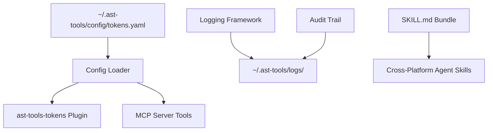

# Phase 0 Implementation Plan — Foundation & Configuration

> **Status:** Draft  
> **Phase:** 0  
> **Timeline:** 1-2 weeks  
> **Dependencies:** None  
> **Draft Date:** 2026-07-31  

---

## Goal

Establish the foundational infrastructure that all subsequent phases build upon: config directory, token management configuration, logging, audit trail, SKILL.md bundle, and config validation.

## Architecture



## Files to Create/Modify

| File | Action | Purpose |
|------|--------|---------|
| `src/ast_tools/config/__init__.py` | Create | Config module init |
| `src/ast_tools/config/loader.py` | Create | YAML config loader with JSON Schema validation |
| `src/ast_tools/config/tokens_schema.py` | Create | JSON Schema for tokens.yaml |
| `src/ast_tools/config/validate.py` | Create | Config validation command |
| `src/ast_tools/logging/__init__.py` | Create | Logging module init |
| `src/ast_tools/logging/setup.py` | Create | Logging setup with rotation |
| `src/ast_tools/logging/audit.py` | Create | Audit trail logger |
| `src/ast_tools/cli.py` | Modify | Add `config validate` subcommand |
| `skills/hermes/ast-tools.skill.md` | Create | Hermes SKILL.md |
| `skills/claude/CLAUDE.md` | Create | Claude Code skill file |
| `skills/ast-tools.skill.md` | Create | Generic cross-platform skill file |
| `hermes-plugins/ast-tools-tokens/__init__.py` | Modify | Read from tokens.yaml instead of hardcoded dict |
| `hermes-plugins/ast-tools-tokens/plugin.yaml` | Modify | Bump version, add deprecation note for hardcoded values |
| `pyproject.toml` | Modify | Add `pyyaml` dependency (schema validation) |

---

## Task Breakdown

### Task 0.1: Config Directory Module

**Objective:** Create the config directory structure and loader that all components use.

**Files:**
- Create: `src/ast_tools/config/__init__.py`
- Create: `src/ast_tools/config/loader.py`
- Create: `src/ast_tools/config/tokens_schema.py`
- Create: `src/ast_tools/config/validate.py`

**Step 1: Define config directory resolver**

```python
# src/ast_tools/config/loader.py
"""Config directory resolution and YAML loading with schema validation."""

import os
from pathlib import Path

def get_config_dir() -> Path:
    """Return the canonical config directory, respecting overrides."""
    # Env override takes priority
    if env_home := os.environ.get("AST_TOOLS_HOME"):
        return Path(env_home)
    # XDG compliance
    xdg_config = os.environ.get("XDG_CONFIG_HOME")
    if xdg_config:
        return Path(xdg_config) / "ast-tools"
    # Default
    return Path.home() / ".ast-tools"

def ensure_config_dir(config_dir: Path = None) -> Path:
    """Create config directory structure if it doesn't exist."""
    cfg = config_dir or get_config_dir()
    for subdir in ["config", "cache/models", "cache/tmp", "logs", "backups"]:
        (cfg / subdir).mkdir(parents=True, exist_ok=True)
    return cfg
```

**Step 2: Define tokens.yaml schema**

```python
# src/ast_tools/config/tokens_schema.py
"""JSON Schema for tokens.yaml validation."""

TOKENS_SCHEMA = {
    "$schema": "https://json-schema.org/draft-07/schema#",
    "type": "object",
    "properties": {
        "token_budgets": {
            "type": "object",
            "description": "Per-tool token limits for result size warnings",
            "properties": {
                "ast_grep": {"type": "integer", "minimum": 100, "maximum": 100000, "default": 2000},
                "structural_analysis": {"type": "integer", "minimum": 100, "maximum": 100000, "default": 4000},
                "impact_analysis": {"type": "integer", "minimum": 100, "maximum": 100000, "default": 3000},
                "semantic_search": {"type": "integer", "minimum": 100, "maximum": 100000, "default": 2500},
                "ast_read": {"type": "integer", "minimum": 100, "maximum": 100000, "default": 1500},
                "ast_edit": {"type": "integer", "minimum": 100, "maximum": 100000, "default": 1000},
                "default": {"type": "integer", "minimum": 100, "maximum": 100000, "default": 1000},
            },
            "additionalProperties": {
                "type": "integer",
                "minimum": 100,
                "maximum": 100000,
            },
        },
        "context_window": {
            "type": "object",
            "description": "Model context window sizes and pressure thresholds",
            "properties": {
                "default": {"type": "integer", "default": 262144},
                "compression_threshold_ratio": {"type": "number", "minimum": 0, "maximum": 1.0, "default": 0.50},
                "warning_threshold_ratio": {"type": "number", "minimum": 0, "maximum": 1.0, "default": 0.40},
                "per_model": {
                    "type": "object",
                    "description": "Per-model overrides",
                    "additionalProperties": {"type": "integer"},
                },
            },
        },
        "token_estimation": {
            "type": "object",
            "description": "Token estimation parameters",
            "properties": {
                "chars_per_token": {"type": "number", "minimum": 1, "maximum": 10, "default": 4.0},
            },
        },
    },
}
```

**Step 3: Config loader with validation**

```python
# src/ast_tools/config/loader.py (continued)
import json
from pathlib import Path
from typing import Any, Dict

def load_tokens_config() -> Dict[str, Any]:
    """Load tokens.yaml, merge with defaults, validate against schema."""
    config_path = get_config_dir() / "config" / "tokens.yaml"
    
    defaults = {
        "token_budgets": {
            "default": 1000,
            "ast_grep": 2000,
            "structural_analysis": 4000,
            "impact_analysis": 3000,
            "semantic_search": 2500,
            "ast_read": 1500,
            "ast_edit": 1000,
        },
        "context_window": {
            "default": 262144,
            "compression_threshold_ratio": 0.50,
            "warning_threshold_ratio": 0.40,
            "per_model": {},
        },
        "token_estimation": {
            "chars_per_token": 4.0,
        },
    }
    
    if not config_path.exists():
        return defaults
    
    import yaml
    raw = yaml.safe_load(config_path.read_text())
    if not raw:
        return defaults
    
    # Deep merge: raw values override defaults
    return _deep_merge(defaults, raw)

def _deep_merge(base: dict, override: dict) -> dict:
    """Recursively merge override into base."""
    result = base.copy()
    for key, val in override.items():
        if key in result and isinstance(result[key], dict) and isinstance(val, dict):
            result[key] = _deep_merge(result[key], val)
        else:
            result[key] = val
    return result
```

**Step 4: Config validate command**

```python
# src/ast_tools/config/validate.py
"""Config validation command."""

from src.ast_tools.config.loader import get_config_dir
from src.ast_tools.config.tokens_schema import TOKENS_SCHEMA

def validate() -> dict:
    """Validate all config files. Returns report dict."""
    config_dir = get_config_dir() / "config"
    results = {"valid": True, "errors": [], "warnings": []}
    
    # Check tokens.yaml
    tokens_path = config_dir / "tokens.yaml"
    if not tokens_path.exists():
        results["warnings"].append(f"tokens.yaml not found at {tokens_path} — using defaults")
    else:
        import yaml, jsonschema
        try:
            data = yaml.safe_load(tokens_path.read_text())
            jsonschema.validate(data, TOKENS_SCHEMA)
            results["checks"].append(f"tokens.yaml: valid")
        except Exception as e:
            results["valid"] = False
            results["errors"].append(f"tokens.yaml: {e}")
    
    return results

def cli_validate(args) -> str:
    """CLI entry point for config validate."""
    import json
    result = validate()
    if args.get("format") == "json":
        return json.dumps(result, indent=2)
    if result["valid"]:
        return "✅ Configuration is valid"
    else:
        lines = ["❌ Configuration has errors:"]
        for err in result.get("errors", []): lines.append(f"  - {err}")
        for warn in result.get("warnings", []): lines.append(f"  ⚠️ {warn}")
        return "\n".join(lines)
```

**Verification:**
```bash
# Test config directory creation
python3 -c "from src.ast_tools.config.loader import ensure_config_dir; print(ensure_config_dir())"

# Test tokens.yaml loading without file (defaults)
python3 -c "from src.ast_tools.config.loader import load_tokens_config; print(load_tokens_config())"

# Test with config file
echo "token_budgets:\n  ast_grep: 5000" > ~/.ast-tools/config/tokens.yaml
python3 -c "from src.ast_tools.config.loader import load_tokens_config; print(load_tokens_config()['token_budgets']['ast_grep'])"
```

---

### Task 0.2: Logging Framework

**Objective:** Structured logging with rotation and audit trail.

**Files:**
- Create: `src/ast_tools/logging/__init__.py`
- Create: `src/ast_tools/logging/setup.py`
- Create: `src/ast_tools/logging/audit.py`

**Key design decisions:**
- JSON structured logging for machine parseability
- Size-based rotation (100MB default) + time-based retention (30 days)
- Log level: INFO by default, DEBUG for verbose mode
- Audit log is append-only JSONL with: timestamp, action, user, params, result

---

### Task 0.3: AST-Tools Tokens Plugin Update

**Objective:** Make `ast-tools-tokens` plugin read from `~/.ast-tools/config/tokens.yaml`.

**Files:**
- Modify: `hermes-plugins/ast-tools-tokens/__init__.py`
- Modify: `hermes-plugins/ast-tools-tokens/plugin.yaml`

**Changes:**
1. Remove hardcoded `AST_TOOLS_TOKEN_BUDGETS` dict
2. Import `load_tokens_config()` from the new config module
3. In `register()`, load config and pass budgets to handlers
4. Fall back to old hardcoded values if config file doesn't exist (backwards compat)

```python
# Modified __init__.py structure
def register(ctx):
    cfg = load_tokens_config()
    budgets = cfg.get("token_budgets", {})
    ctx.register_hook("post_tool_call", partial(track_ast_tools_usage, budgets=budgets))
    ctx.register_hook("pre_llm_call", partial(check_context_pressure, cfg=cfg))
```

**Verification:**
```bash
# Without config file — uses defaults, no crash
hermes restart

# With config file — overrides take effect
echo "token_budgets:\n  ast_grep: 5000" > ~/.ast-tools/config/tokens.yaml
hermes restart
```

---

### Task 0.4: SKILL.md Cross-Platform Bundle

**Objective:** Create platform-agnostic skill files for agents.

**Files:**
- Create: `skills/hermes/ast-tools.skill.md` (Hermes v2 format)
- Create: `skills/claude/CLAUDE.md` (Claude Code format)
- Create: `skills/ast-tools.skill.md` (generic markdown)

**Structure (each skill includes):**
- Frontmatter (name, description, tags)
- Tool catalog (all 43 tools grouped by category)
- Usage patterns (search, edit, analyze workflows)
- Installation instructions
- Troubleshooting guide
- Example queries

**Verification:**
```bash
# Test Hermes loads the skill
hermes -s skills/hermes/ast-tools.skill.md

# Test markdown renders correctly
python3 -c "import markdown; html = markdown.markdown(open('skills/ast-tools.skill.md').read()); print(len(html), 'chars rendered')"
```

---

### Task 0.5: CLI Config Integration

**Objective:** Add `ast-tools config` subcommand.

**Files:**
- Modify: `src/ast_tools/cli.py`

**New commands:**
```
ast-tools config validate    — Validate all config files
ast-tools config path        — Print config directory path
ast-tools config init        — Create default config files
```

---

## Test Plan

| Test | What it verifies | Command |
|------|-----------------|---------|
| Config dir creation | Structure created | `python3 -c "from src.ast_tools.config.loader import ensure_config_dir; ..."` |
| tokens.yaml loading | Defaults without file | `python3 -c "from src.ast_tools.config.loader import load_tokens_config; ..."` |
| tokens.yaml schema | Invalid values rejected | Write bad YAML, run validate, assert error |
| Backwards compat | No crash without config | Run plugin without `~/.ast-tools/` |
| Config validate CLI | Command works | `python3 -m src.ast_tools config validate` |
| Skill file render | Valid markdown | Check frontmatter + content render |

## Verification Checklist

- [ ] `~/.ast-tools/` directory created with `config/`, `cache/`, `logs/`, `backups/`
- [ ] `tokens.yaml` loaded and merged with defaults
- [ ] Invalid tokens.yaml produces clear error message
- [ ] ast-tools-tokens plugin works with and without config file
- [ ] SKILL.md files render correctly in all target formats
- [ ] `ast-tools config validate` returns clean health report
- [ ] All existing 409 tests still pass