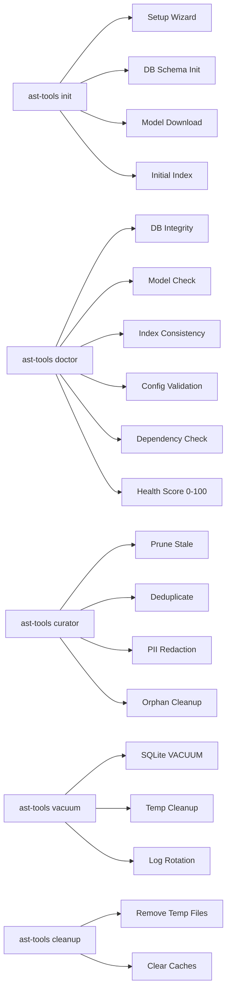

# Phase 1 Implementation Plan — Data Lifecycle & Operations

> **Status:** Draft  
> **Phase:** 1  
> **Timeline:** 2 weeks  
> **Dependencies:** Phase 0 (config directory, logging, audit)  
> **Draft Date:** 2026-07-31  

---

## Goal

Implement the full data lifecycle: setup wizard, doctor command, vacuum, curation daemon (with PII redaction), and cleanup. These commands ensure the AST-Tools database never grows unbounded and users can diagnose, maintain, and repair their deployment.

## Architecture



## Files to Create/Modify

| File | Action | Purpose |
|------|--------|---------|
| `src/ast_tools/curator/init.py` | Create | Init/setup wizard logic |
| `src/ast_tools/curator/doctor.py` | Create | Doctor / healthcheck logic |
| `src/ast_tools/curator/vacuum.py` | Create | Vacuum / space reclamation |
| `src/ast_tools/curator/curator.py` | Create | Curation daemon + one-shot |
| `src/ast_tools/curator/pii.py` | Create | PII detection & redaction |
| `src/ast_tools/curator/cleanup.py` | Create | Cleanup logic |
| `src/ast_tools/cli.py` | Modify | Add `init`, `doctor`, `vacuum`, `curator`, `cleanup` subcommands |
| `tests/curator/test_init.py` | Create | Setup wizard tests |
| `tests/curator/test_doctor.py` | Create | Doctor tests |
| `tests/curator/test_vacuum.py` | Create | Vacuum tests |
| `tests/curator/test_curator.py` | Modify | Extend existing curator tests |
| `tests/curator/test_pii.py` | Create | PII redaction tests |

---

## Task Breakdown

### Task 1.1: Setup Wizard

**Objective:** Interactive first-time setup with `--non-interactive` mode.

**Files:** `src/ast_tools/curator/init.py`

**Key features:**
1. Detect environment (Python version, dependencies, disk space)
2. Create config directory if not exists
3. Download embedding model (with progress bar, resume support, checksum verification)
4. Initialize SQLite database schema
5. Create initial index of current workspace
6. Save setup log to `~/.ast-tools/logs/setup.log`

**CLI:**
```
ast-tools init                    # Interactive mode
ast-tools init --non-interactive  # Auto mode (smart defaults)
ast-tools init --model-path /custom/model  # Pre-downloaded model path
ast-tools init --skip-model       # No model (FTS5 only, no semantic search)
```

**Verification:**
```bash
ast-tools init --non-interactive --skip-model
ast-tools doctor  # Should show healthy state
```

---

### Task 1.2: Doctor Command

**Objective:** Comprehensive healthcheck with score.

**Files:** `src/ast_tools/curator/doctor.py`

**Checks:**
1. **DB Integrity:** `PRAGMA integrity_check` + `PRAGMA quick_check`
2. **Schema Version:** Current vs expected migration version
3. **Model Availability:** Embedding model loads and returns embeddings
4. **Index Consistency:** No dangling references (every embedding has a parent symbol)
5. **Config Validation:** All config files pass schema validation
6. **Dependency Check:** All required packages importable, tree-sitter grammars available
7. **Disk Space:** At least 500MB free for operations

**Health Score:**
```
Score 0-100:
- Critical (70 pts): DB exists, schema matches, model loads
- Normal (20 pts): Index consistent, config valid
- Optional (10 pts): >=500MB free, recent curation
```

**CLI:**
```
ast-tools doctor                   # Summary report
ast-tools doctor --verbose         # Detailed per-check output
ast-tools doctor --format json     # Machine-readable
ast-tools doctor --fix             # Auto-fix discovered issues
```

**Verification:**
```bash
ast-tools doctor
# Should output: "✅ Health Score: 95/100 — Healthy"
```

---

### Task 1.3: Vacuum Command

**Objective:** Reclaim disk space.

**Files:** `src/ast_tools/curator/vacuum.py`

**Operations:**
1. SQLite `VACUUM` + `REINDEX`
2. Delete `cache/tmp/` contents
3. Rotate logs older than configured retention (default 30 days)
4. Remove unused model variants (e.g., if user switched models)

**CLI:**
```
ast-tools vacuum                   # Default vacuum
ast-tools vacuum --aggressive      # Also clear model cache
ast-tools vacuum --dry-run         # Show what would be freed
```

---

### Task 1.4: Curation Daemon

**Objective:** Scheduled maintenance with pruning, dedup, and PII redaction.

**Files:** `src/ast_tools/curator/curator.py`, `src/ast_tools/curator/pii.py`

**Curation operations:**
1. **Prune stale:** Remove symbols where source files no longer exist
2. **Deduplicate:** Content-hash comparison, merge identical symbols, keep latest
3. **PII redaction:** Scan symbol names, comments, docstrings. Configurable action per pattern:
   - `redact` — Replace with `[REDACTED]`
   - `flag` — Add to audit log only (no modification)
   - `remove` — Delete the symbol
4. **Orphan cleanup:** Delete embeddings without parent symbols, edges without endpoints

**PII patterns:**
```python
PII_PATTERNS = {
    "email": r'[\w\.-]+@[\w\.-]+\.\w+',
    "api_key": r'(?i)(api[-_]?key|secret|token|password)\s*[:=]\s*[\'"][^\'"]+[\'"]',
    "file_path": r'(?:/home/|/Users/|C:\\|/var/)[^\s]+',
    "ip_address": r'\b\d{1,3}\.\d{1,3}\.\d{1,3}\.\d{1,3}\b',
}
```

**Daemon scheduling:**
```yaml
# ~/.ast-tools/config/server.yaml
curator:
  enabled: true
  schedule: "0 2 * * 0"  # Weekly on Sunday at 2am
  pii_action: "flag"      # flag | redact | remove
  retention_days: 90      # Remove symbols not referenced in 90 days
```

**CLI:**
```
ast-tools curator run               # One-shot curation
ast-tools curator status            # Last run, next run, stats
ast-tools curator enable|disable    # Toggle daemon
```

---

### Task 1.5: Cleanup Command

**Objective:** Remove temporary and stale files.

**Files:** `src/ast_tools/curator/cleanup.py`

**Operations:**
1. Delete `cache/tmp/` contents
2. Remove expired caches (>7 days since last access)
3. Delete stale log files (>retention days)
4. Optional: shrink database with VACUUM

**CLI:**
```
ast-tools cleanup                    # Default cleanup
ast-tools cleanup --aggressive       # Also clear model cache
ast-tools cleanup --dry-run         # Show what would be removed
```

---

### Task 1.6: CLI Integration

**Objective:** Wire all commands into the CLI.

**Files:** Modify `src/ast_tools/cli.py`

**New subcommands:**
```
ast-tools init      — Setup wizard (Task 1.1)
ast-tools doctor    — Healthcheck (Task 1.2)  
ast-tools vacuum    — Space reclamation (Task 1.3)
ast-tools curator   — Curation daemon (Task 1.4)
ast-tools cleanup   — Temp file removal (Task 1.5)
```

---

### Task 1.7: Hermes Plugin Maintenance

**Objective:** Update existing Hermes plugins for Phase 0-1 compatibility.

**Files:**
- Modify: `hermes-plugins/ast-tools-context/__init__.py`
- Modify: `hermes-plugins/ast-tools-context/plugin.yaml`
- Create: `hermes-plugins/ast-tools-project-context/` (new plugin)

**ast-tools-context updates:**
- Reference tokens.yaml thresholds for context injection
- Update tool documentation to reflect current 43 tools
- Add version checking against MCP server

**ast-tools-project-context (NEW):**
- `pre_llm_call` hook that injects current project metadata
- Reads `project.json` from target codebase
- Provides: project name, language distribution, file count, test count

---

## Test Plan

| Test | What it verifies |
|------|-----------------|
| Init creates directory | `ast-tools init` creates `~/.ast-tools/` |
| Init runs without model | `--skip-model` flag works |
| Doctor returns health score | All checks execute, returns 0-100 |
| Doctor fix repairs issues | `--fix` resolves detected problems |
| Vacuum shrinks DB | Database file size decreases |
| Curator removes stale symbols | After deleting a source file, curator run removes its symbols |
| PII redacts emails | Symbol with "user@example.com" gets redacted |
| Cleanup removes tmp files | `cache/tmp/` contents removed |
| All existing tests pass | `pytest tests/ -q --tb=short` |

## Verification Checklist

- [ ] `ast-tools init --non-interactive` creates `~/.ast-tools/` with all subdirs
- [ ] `ast-tools doctor` returns health score ≥ 60 for clean install
- [ ] `ast-tools vacuum` reduces DB size (measurable)
- [ ] `ast-tools curator run` completes without errors
- [ ] PII redaction catches test email patterns
- [ ] All existing 409 tests pass after changes
- [ ] Hermes plugins load without errors after updates