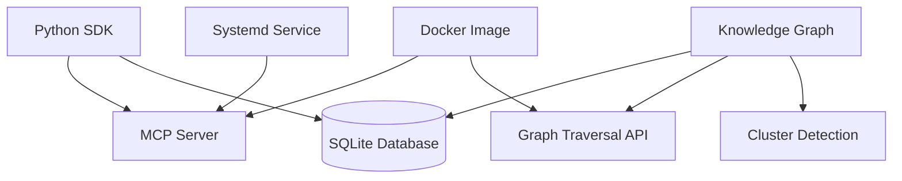

# Phase 2 Implementation Plan — SDK, Knowledge Graph & Docker

> **Status:** Draft  
> **Phase:** 2  
> **Timeline:** 3 weeks  
> **Dependencies:** Phase 1 (data lifecycle commands operational)  
> **Draft Date:** 2026-07-31  

---

## Goal

Create the three pillars of external consumption: a Python SDK for programmatic access, a knowledge graph query layer for advanced intelligence, and Docker deployment infrastructure for production use.

## Architecture



## Files to Create/Modify

| File | Action | Purpose |
|------|--------|---------|
| `sdk/python/ast_tools_sdk/__init__.py` | Create | SDK init |
| `sdk/python/ast_tools_sdk/client.py` | Create | SDK client (MCP-based) |
| `sdk/python/ast_tools_sdk/models.py` | Create | Data models |
| `sdk/python/ast_tools_sdk/analysis.py` | Create | High-level analysis interface |
| `sdk/python/pyproject.toml` | Create | SDK build config |
| `sdk/python/README.md` | Create | SDK docs |
| `src/ast_tools/indexer/knn_builder.py` | Modify | Extend for full KG support |
| `src/ast_tools/indexer/knowledge_graph.py` | Create | KG query layer |
| `src/ast_tools/indexer/clustering.py` | Create | Symbol clustering |
| `Dockerfile` | Create | Production Docker image |
| `docker-compose.yml` | Create | Docker Compose for server+dashboard |
| `deploy/ast-tools.service` | Create | Systemd service file |
| `tests/sdk/test_client.py` | Create | SDK client tests |
| `tests/indexer/test_knowledge_graph.py` | Create | KG tests |
| `tests/indexer/test_clustering.py` | Create | Clustering tests |

---

## Task Breakdown

### Task 2.1: Python SDK

**Objective:** Programmatic Python interface to all AST-Tools capabilities.

**SDK Package Structure:**
```
sdk/python/
├── pyproject.toml
├── README.md
├── src/ast_tools_sdk/
│   ├── __init__.py        # Exports: Client, SearchResult, Symbol, etc.
│   ├── client.py          # MCP-based client (connects to running server)
│   ├── models.py          # Symbol, Edge, Cluster, SearchResult dataclasses
│   └── analysis.py        # High-level: search(), analyze(), find_dead_code(), etc.
└── tests/
    └── test_client.py
```

**Client API:**
```python
from ast_tools_sdk import Client

client = Client()  # Connects to local MCP server by default

# Search
results = client.search("authentication", limit=10)
for symbol in results:
    print(f"{symbol.name} ({symbol.kind}) @ {symbol.file}:{symbol.line}")

# Impact analysis
impact = client.impact_analysis("src/auth.py:42")
print(f"Impact: {impact.affected_files} files, {impact.affected_symbols} symbols")

# Knowledge graph
neighbors = client.graph.neighbors("SessionManager", edge_types=["calls", "imports"])
path = client.graph.path("auth.authenticate", "db.connect")

# Raw stats (free tier)
stats = client.stats()
print(f"Symbols: {stats.total_symbols}, Edges: {stats.total_edges}")
```

**MCP Communication:**
```python
# SDK connects to the MCP server via stdio by default
client = Client(transport="stdio", command="ast-tools-server")

# Or via TCP (for remote/server deployment)
client = Client(transport="tcp", host="localhost", port=8080)
```

---

### Task 2.2: Knowledge Graph Query Layer

**Objective:** Extend beyond simple KNN neighbors to full graph traversal.

**Files:** `src/ast_tools/indexer/knowledge_graph.py`, `src/ast_tools/indexer/clustering.py`

**Query API:**
```python
# Single-hop neighbors
kg.neighbors(symbol_id=42, edge_types=["calls", "imports"])
# Returns: [Neighbor(symbol_id=43, relation="calls", weight=0.9), ...]

# Multi-hop traversal (BFS)
kg.breadth_first(start_id=42, edge_types=["calls"], max_depth=3)
# Returns: [{depth: 1, symbols: [...]}, {depth: 2, symbols: [...]}, ...]

# Shortest path between two symbols
kg.shortest_path(source_id=42, target_id=100)
# Returns: [42, 57, 83, 100]  # Path via intermediate symbols

# Symbol clustering
kg.clusters(min_cluster_size=5)
# Returns: [Cluster(id=1, name="auth", size=12), ...]
```

**Database extensions (see ADR-004):**
```sql
ALTER TABLE edges ADD COLUMN weight REAL DEFAULT 1.0;
ALTER TABLE edges ADD COLUMN metadata TEXT;  -- JSON
ALTER TABLE edges ADD COLUMN created_at TEXT;
CREATE INDEX idx_edges_source_type ON edges(source_id, edge_type);
CREATE INDEX idx_edges_target_type ON edges(target_id, edge_type);
```

**CLI integration:**
```
ast-tools kg neighbors <symbol> [--edge-types calls,imports] [--depth 2]
ast-tools kg path <source> <target>
ast-tools kg clusters [--min-size 5]
```

---

### Task 2.3: Docker Image

**Objective:** Production-ready Docker image for server deployment.

**Files:** `Dockerfile`, `docker-compose.yml`

**Dockerfile design:**
```dockerfile
# Multi-stage build
FROM python:3.12-slim AS builder
RUN pip install ast-tools
RUN python3 -c "from sentence_transformers import SentenceTransformer; SentenceTransformer('BAAI/bge-small-en-v1.5')"

FROM python:3.12-slim
COPY --from=builder /usr/local/lib/python3.12/site-packages /usr/local/lib/python3.12/site-packages
COPY --from=builder /root/.cache /root/.cache
EXPOSE 8080
ENTRYPOINT ["ast-tools-server"]
```

**docker-compose.yml:**
```yaml
version: "3.8"
services:
  ast-tools:
    build: .
    ports:
      - "8080:8080"
    volumes:
      - ~/.ast-tools:/root/.ast-tools
      - ${PROJECT_PATH:-.}:/workspace
    environment:
      - AST_TOOLS_HOME=/root/.ast-tools
```

---

### Task 2.4: Systemd Service

**Objective:** Persistent server operation via systemd.

**Files:** `deploy/ast-tools.service`

**Service file:**
```ini
[Unit]
Description=AST-Tools MCP Server
After=network.target

[Service]
Type=simple
ExecStart=/usr/local/bin/ast-tools-server
Restart=on-failure
RestartSec=5
User=%i
Environment=AST_TOOLS_HOME=%h/.ast-tools

[Install]
WantedBy=default.target
```

**CLI integration:**
```
ast-tools server install    # Install systemd service
ast-tools server start      # Start service
ast-tools server stop       # Stop service
ast-tools server status     # Check service status
```

---

## Test Plan

| Test | What it verifies |
|------|-----------------|
| SDK imports cleanly | `pip install -e sdk/python/ && python3 -c "from ast_tools_sdk import Client"` |
| SDK connects to MCP | Client connects to running server |
| SDK search returns results | `client.search("test")` returns list |
| KG neighbors query | Returns correct neighbors for known symbol |
| KG shortest path | Returns valid path between connected symbols |
| Docker image builds | `docker build -t ast-tools .` succeeds |
| Docker server starts | `docker run ast-tools --help` shows help |
| Systemd service installs | `ast-tools server install` creates .service file |
| All existing tests pass | `pytest tests/ -q --tb=short` |

## Verification Checklist

- [ ] SDK package installed via `pip install` and imports cleanly
- [ ] SDK client connects to running MCP server
- [ ] SDK search, analyze, and stats methods return expected types
- [ ] Knowledge graph queries return correct results on test data
- [ ] Clustering produces interpretable clusters
- [ ] Docker image builds and runs
- [ ] Systemd service installs and starts
- [ ] All 409+ existing tests pass