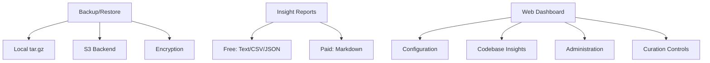

# Phase 3 Implementation Plan — Backup, Reporting & Dashboard

> **Status:** Draft  
> **Phase:** 3  
> **Timeline:** 3 weeks  
> **Dependencies:** Phase 2 (SDK, Docker)  
> **Draft Date:** 2026-07-31  

---

## Goal

Deliver the value layer: backup/restore for data safety, codebase insight reporting for user value, and a web dashboard for administration. This phase transitions AST-Tools from "developer tool" to "production system."

## Architecture



## Files to Create/Modify

| File | Action | Purpose |
|------|--------|---------|
| `src/ast_tools/backup/__init__.py` | Create | Backup module |
| `src/ast_tools/backup/archive.py` | Create | tar.gz archiving |
| `src/ast_tools/backup/backends.py` | Create | Storage backends (local, S3) |
| `src/ast_tools/backup/encrypt.py` | Create | AES-256-GCM encryption |
| `src/ast_tools/backup/restore.py` | Create | Restore logic |
| `src/ast_tools/reporting/__init__.py` | Create | Reporting module |
| `src/ast_tools/reporting/stats.py` | Create | Raw stats generation (free) |
| `src/ast_tools/reporting/markdown.py` | Create | Markdown report (paid) |
| `src/ast_tools/curator/cleanup.py` | Modify | Add deduplication |
| `src/ast_tools/curator/uninstall.py` | Create | Uninstall logic |
| `dashboard/` | Create | Web dashboard directory |
| `dashboard/backend/` | Create | Dashboard API server |
| `dashboard/frontend/` | Create | React + Tailwind + shadcn/ui |
| `tests/backup/test_archive.py` | Create | Backup tests |
| `tests/backup/test_encrypt.py` | Create | Encryption tests |
| `tests/backup/test_restore.py` | Create | Restore tests |
| `tests/reporting/test_stats.py` | Create | Stats tests |
| `tests/curator/test_dedup.py` | Create | Dedup tests |
| `tests/curator/test_uninstall.py` | Create | Uninstall tests |

---

## Task Breakdown

### Task 3.1: Backup/Restore System

**Objective:** Full + incremental backup with local and remote backends, optional encryption.

**CLI:**
```
ast-tools backup                    # Full backup to default dir
ast-tools backup --incremental      # Incremental (requires full baseline)
ast-tools backup --remote s3://my-bucket/ast-tools/
ast-tools backup --encrypt
ast-tools backup list               # List available backups

ast-tools restore                   # Interactive restore from latest
ast-tools restore --backup /path/to/backup.tar.gz
ast-tools restore --list            # List backups and choose
```

**Archive structure (see ADR-006):**
```
ast-tools-backup-2026-07-31.tar.gz
├── meta.yaml (version, date, checksums, mode: full/incremental)
├── config/ (copy of ~/.ast-tools/config/)
├── database/codebase.db.gz (VACUUM'd + gzipped)
└── cache/models/ (only with --include-models)
```

**Remote backends:**
- S3 (`boto3`) — AES-256-SSE server-side or client-side encryption
- SFTP (`paramiko`) — SSH key authentication
- Local — `~/.ast-tools/backups/`

---

### Task 3.2: Codebase Insights Reporting

**Objective:** Generate codebase intelligence reports from indexed data.

**Free tier (raw stats):**
```
ast-tools insights                    # Summary to stdout
ast-tools insights --format csv      # CSV export
ast-tools insights --format json     # JSON export
ast-tools insights --format text     # Human-readable text
```

**Paid tier (formatted):**
```
ast-tools insights --format markdown # Beautiful markdown report (Team+)
```

**Report content:**
- Total symbols by kind (functions, classes, methods, variables)
- Language distribution
- Dependency heatmap (most imported modules)
- Complexity hotspots (high fan-in, high fan-out)
- Dead code candidates (never-imported symbols)
- Test coverage estimation (test file ratio)
- Recent changes (git-based diff stats)
- Quality metrics (lint error density, type annotation coverage)

---

### Task 3.3: Deduplication Engine

**Objective:** Content-hash based dedup with confidence scoring.

**Files:** Extend `src/ast_tools/curator/cleanup.py`

**Dedup algorithm:**
1. Hash file contents with SHA256
2. Group identical hashes
3. For each group, keep the symbol with the most references (highest fan-in)
4. Re-link all references to the survivor symbol
5. Delete merged symbols and their orphaned embeddings

**CLI:**
```
ast-tools curator dedup              # Run dedup
ast-tools curator dedup --dry-run    # Preview without modifying
ast-tools curator dedup --aggressive # Also merge similar (not identical) symbols
```

---

### Task 3.4: Uninstall Command

**Objective:** Clean removal of all artifacts.

**Files:** `src/ast_tools/curator/uninstall.py`

**Operations:**
1. Remove `~/.ast-tools/` directory entirely
2. Remove systemd service (if installed by Phase 2)
3. Remove Hermes plugin references from `~/.hermes/plugins/`
4. Offer to create a backup before uninstall
5. Confirm: "Are you sure? This will delete ALL data."

**CLI:**
```
ast-tools uninstall                  # Interactive, with backup prompt
ast-tools uninstall --force          # Skip confirmation
ast-tools uninstall --preserve-config # Keep config, remove data only
```

---

### Task 3.5: Web Dashboard (Local)

**Objective:** Local web UI for configuration, insights, and administration.

**Tech stack:** Tailwind CSS CDN (free tier) → React + shadcn/ui (pro tier)

**Free dashboard features:**
- Server status (running/stopped, health score)
- Basic index statistics (symbols count, DB size, last curation)
- Configuration viewer (read-only)

**Paid dashboard features (Phase 5):**
- Full configuration editor
- Curation scheduler controls
- Backup management GUI
- Advanced analytics charts
- Multi-machine admin panel

**Backend:** Python (FastAPI or minimal Flask) running as part of `ast-tools-server`

**Frontend:** HTML + Tailwind CDN (Phase 3 MVP), React + shadcn/ui (Phase 5 pro)

**CLI:**
```
ast-tools dashboard                  # Start dashboard (default port 8081)
ast-tools dashboard --port 3000      # Custom port
ast-tools dashboard --stop           # Stop dashboard server
```

---

## Test Plan

| Test | What it verifies |
|------|-----------------|
| Backup creates valid archive | `tar -tzf backup.tar.gz` shows expected structure |
| Backup with encryption | Encrypted file not readable without password |
| Restore from backup | Data matches pre-backup state |
| Incremental backup smaller than full | `du -sh` comparison |
| S3 backup | Backup uploaded to S3 bucket |
| Stats generation | All metrics present and non-empty |
| Markdown report renders | Valid markdown output |
| Dedup merges identical symbols | Reference count preserved after merge |
| Uninstall removes all files | `~/.ast-tools/` no longer exists |
| Dashboard starts | HTTP 200 on health endpoint |

## Verification Checklist

- [ ] `ast-tools backup` creates valid `.tar.gz` archive
- [ ] `ast-tools restore --backup X` restores data correctly
- [ ] Encrypted backup requires password for restore
- [ ] `ast-tools insights --format json` returns valid JSON with all metrics
- [ ] `ast-tools curator dedup --dry-run` reports expected merges
- [ ] `ast-tools uninstall` removes all artifacts (with confirmation)
- [ ] Dashboard starts on port 8081 and shows server status
- [ ] All existing tests pass