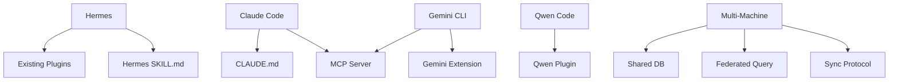

# Phase 4 Implementation Plan — Agent Ecosystem & Multi-Machine

> **Status:** Draft  
> **Phase:** 4  
> **Timeline:** 3 weeks  
> **Dependencies:** Phase 3 (backup/restore, reporting operational)  
> **Draft Date:** 2026-07-31  

---

## Goal

Expand AST-Tools reach to all major AI coding agents and enable multi-machine deployments. This phase builds the revenue-generating integrations (Gemini CLI, Claude Code) and the high-value infrastructure (distributed support, cross-repo resolution).

## Architecture



## Files to Create/Modify

| File | Action | Purpose |
|------|--------|---------|
| `extensions/gemini/extension.yaml` | Create | Gemini CLI extension manifest |
| `extensions/gemini/ast_tools_bridge.py` | Create | Gemini → ast-tools bridge |
| `extensions/claude/CLAUDE.md` | Create | Claude Code skill file |
| `extensions/claude/tools.yaml` | Create | Claude Code tool definitions |
| `src/ast_tools/server/federation.py` | Create | Multi-machine query federation |
| `src/ast_tools/indexer/cross_repo.py` | Create | Cross-repository resolution |
| `src/ast_tools/reporting/docx.py` | Create | DOCX report generation |
| `src/ast_tools/reporting/pdf.py` | Create | PDF report generation |
| `src/ast_tools/indexer/analytics.py` | Create | Usage analytics |
| `tests/extensions/test_gemini.py` | Create | Gemini extension tests |
| `tests/extensions/test_claude.py` | Create | Claude integration tests |
| `tests/server/test_federation.py` | Create | Multi-machine tests |
| `tests/indexer/test_cross_repo.py` | Create | Cross-repo tests |

---

## Task Breakdown

### Task 4.1: Gemini CLI Extension

**Objective:** First-class Gemini CLI integration.

**Extension structure:**
```yaml
# extensions/gemini/extension.yaml
name: ast-tools
version: 1.0.0
description: "Structural code analysis and editing via AST-Tools"
tools:
  - ast_grep
  - semantic_search
  - impact_analysis
  - codebase_summary
```

**Bridge script** connects Gemini CLI to the AST-Tools MCP server via stdio. Gemini CLI can then invoke:
```bash
# In Gemini CLI session
> ast_grep pattern="def $FUNC($$$ARGS)"
> semantic_search query="authentication middleware"
```

---

### Task 4.2: Claude Code Integration

**Objective:** Claude Code can use AST-Tools via CLAUDE.md + tools definition.

**Files:**
- `extensions/claude/CLAUDE.md` — Skill file describing available tools
- `extensions/claude/tools.yaml` — Claude Code tool definitions mapping to MCP commands

**Claude Code tool definition:**
```yaml
# tools.yaml
tools:
  - name: codebase_search
    description: "Semantic search across the entire codebase"
    command: ast-tools semantic_search --query "{query}" --limit {limit}
    parameters:
      query: string (required)
      limit: integer (optional, default 10)
```

**Usage in Claude Code:**
```
> Use codebase_search to find authentication-related code
> Then analyze the impact of changing src/auth.py:42
```

---

### Task 4.3: Multi-Machine Support

**Objective:** Deploy AST-Tools across multiple machines with shared/federated indexes.

**Architecture options:**
1. **Shared database** (simplest): All machines connect to NFS/S3-backed SQLite. Read-only for workers, write lock for curator.
2. **Federated query** (complex): Each machine has local index, queries distributed via broker. Uses Redis or NATS for coordination.

**Phase 4 implements Option 1 (shared database). Option 2 is post-launch.**

**CLI:**
```
ast-tools server join --remote user@host:~/ast-tools-data
ast-tools server status --peers    # Show connected machines
ast-tools server sync              # Sync local index to shared storage
```

**Locking protocol:**
```python
# Shared database uses advisory lock to prevent concurrent writes
import fcntl
with open(LOCK_FILE, "w") as f:
    fcntl.flock(f, fcntl.LOCK_EX)
    # Perform write operation
    fcntl.flock(f, fcntl.LOCK_UN)
```

---

### Task 4.4: Cross-Repository Symbol Resolution

**Objective:** Resolve symbols across repository boundaries.

**Resolution strategies:**
1. **Exact match** (default): symbol_name + file_path match
2. **Fuzzy match** (optional): edit distance + context similarity
3. **Canonical name** (future): upstream package metadata

**CLI:**
```
ast-tools kg resolve SessionManager              # Find across all repos
ast-tools kg resolve SessionManager --repo auth-service  # Scoped
```

---

### Task 4.5: DOCX/PDF Report Generation

**Objective:** Professional formatted reports for paid tier.

**Implementation:**
- **DOCX:** Use `python-docx` to generate .docx files
- **PDF:** Use `weasyprint` for HTML→PDF conversion (more reliable than wkhtmltopdf)

**CLI:**
```
ast-tools insights --format docx --output report.docx  # Team+
ast-tools insights --format pdf --output report.pdf     # Team+
```

---

### Task 4.6: Usage Analytics

**Objective:** Understand how AST-Tools is used (privacy-first).

**Data collected (local only, opt-in telemetry):**
- Query frequency by tool
- Error rates and types
- Index size over time
- Curation effectiveness (stale symbols removed per run)

**CLI:**
```
ast-tools analytics                   # Show local analytics dashboard
ast-tools analytics --export json     # Export raw data
ast-tools analytics --reset           # Reset analytics data
```

**Telemetry (opt-in only):**
```yaml
# ~/.ast-tools/config/server.yaml
telemetry:
  enabled: false  # Default off
  endpoint: https://telemetry.rapidwebs.com
  interval_hours: 24
```

---

## Test Plan

| Test | What it verifies |
|------|-----------------|
| Gemini extension loads | `gemini-cli --load-extension extensions/gemini/` |
| Claude tool definitions parse | Valid YAML, correct command references |
| Multi-machine shared DB | Two processes read/write same SQLite without corruption |
| Cross-repo resolution | Symbol found across indexed repos |
| DOCX generation | `python-docx` creates valid .docx |
| PDF generation | `weasyprint` creates valid .pdf |
| Analytics tracks queries | Query count increments correctly |

## Verification Checklist

- [ ] Gemini CLI can invoke at least 3 AST-Tools tools
- [ ] Claude Code loads and uses tool definitions
- [ ] Two machines can share the same SQLite database
- [ ] Cross-repo resolution returns expected results
- [ ] DOCX/PDF reports render correctly
- [ ] Analytics dashboard shows meaningful data
- [ ] All existing tests pass