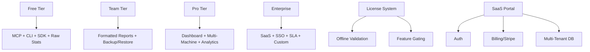

# Phase 5 Implementation Plan — Monetization & Advanced Features

> **Status:** Draft  
> **Phase:** 5  
> **Timeline:** 4 weeks  
> **Dependencies:** Phase 4 (agent ecosystem, multi-machine operational)  
> **Draft Date:** 2026-07-31  

---

## Goal

Implement the revenue infrastructure: tier gating, license management, SaaS deployment, and advanced paid features (concept extraction, pro dashboard, pro reports). This phase transforms AST-Tools from open-source project into a sustainable business.

## Architecture



## Files to Create/Modify

| File | Action | Purpose |
|------|--------|---------|
| `src/ast_tools/license/__init__.py` | Create | License module |
| `src/ast_tools/license/validator.py` | Create | Offline license validation |
| `src/ast_tools/license/gating.py` | Create | Feature gating logic |
| `src/ast_tools/license/keygen.py` | Create | License key generation |
| `src/ast_tools/server/saas.py` | Create | Multi-tenant SaaS backend |
| `src/ast_tools/indexer/concepts.py` | Create | Concept extraction |
| `dashboard/frontend/pro/` | Create | Pro React dashboard |
| `dashboard/backend/billing.py` | Create | Stripe billing integration |
| `tests/license/test_validation.py` | Create | License tests |
| `tests/license/test_gating.py` | Create | Feature gating tests |
| `tests/indexer/test_concepts.py` | Create | Concept extraction tests |

---

## Task Breakdown

### Task 5.1: License System

**Objective:** Offline-capable license validation for feature gating.

**License file format (JWT-based):**
```json
// license.json — signed JWT
{
  "sub": "customer@company.com",
  "tier": "pro",
  "exp": 1893456000,     // Unix timestamp
  "features": ["dashboard", "multi_machine", "formatted_reports"],
  "seat_count": 5,
  "iss": "rapidwebs.com"
}
```

**Validation:**
```python
def check_license() -> dict:
    """Check license file, return tier + features."""
    license_path = Path("~/.ast-tools/license.json").expanduser()
    if not license_path.exists():
        return {"tier": "free", "features": []}
    
    try:
        payload = verify_jwt(license_path)  # RSA public key verification
        if payload["exp"] < time.time():
            return {"tier": "free", "features": [], "reason": "expired"}
        return {"tier": payload["tier"], "features": payload["features"]}
    except Exception:
        return {"tier": "free", "features": [], "reason": "invalid"}
```

**Feature gating:**
```python
# Decorator for paid features
def require_tier(min_tier: str):
    def decorator(func):
        @functools.wraps(func)
        def wrapper(*args, **kwargs):
            license_info = check_license()
            tier_rank = {"free": 0, "team": 1, "pro": 2, "enterprise": 3}
            if tier_rank.get(license_info["tier"], 0) < tier_rank.get(min_tier, 0):
                raise LicenseError(f"Requires {min_tier} tier or higher")
            return func(*args, **kwargs)
        return wrapper
    return decorator
```

---

### Task 5.2: Feature Gating Integration

**Objective:** Wire tier gating into all paid features.

**Gated features by tier:**

| Feature | Free | Team ($29) | Pro ($49) | Enterprise |
|---------|------|-----------|-----------|------------|
| MCP Server | ✅ | ✅ | ✅ | ✅ |
| CLI | ✅ | ✅ | ✅ | ✅ |
| Python SDK | ✅ | ✅ | ✅ | ✅ |
| Raw stats (CSV/JSON) | ✅ | ✅ | ✅ | ✅ |
| Markdown reports | ❌ | ✅ | ✅ | ✅ |
| DOCX reports | ❌ | ✅ | ✅ | ✅ |
| PDF reports | ❌ | ✅ | ✅ | ✅ |
| Backup/Restore (local) | ❌ | ✅ | ✅ | ✅ |
| Backup encryption | ❌ | ❌ | ✅ | ✅ |
| Remote backup (S3) | ❌ | ❌ | ✅ | ✅ |
| Web Dashboard | ❌ | ❌ | ✅ | ✅ |
| Multi-machine | ❌ | ❌ | ✅ | ✅ |
| Pro Dashboard | ❌ | ❌ | ✅ | ✅ |
| SaaS Hosting | ❌ | ❌ | ❌ | ✅ |
| SSO/SAML | ❌ | ❌ | ❌ | ✅ |
| Dedicated Support | ❌ | ❌ | ❌ | ✅ |

**CLI:**
```
ast-tools license status              # Show current tier + features
ast-tools license activate <key>      # Activate license from key
ast-tools license deactivate          # Remove license
ast-tools license info                # Show detailed license info
```

---

### Task 5.3: SaaS Deployment (Optional — If Demand Justifies)

**Objective:** Multi-tenant SaaS portal for Pro/Enterprise users.

**Architecture:**
```
┌─────────────┐     ┌─────────────┐     ┌─────────────┐
│  Dashboard   │────▶│  API Server │────▶│  PostgreSQL │
│  (React)     │     │  (FastAPI)  │     │  (Tenants)  │
└─────────────┘     └──────┬──────┘     └─────────────┘
                           │
                    ┌──────▼──────┐
                    │  Billing    │
                    │  (Stripe)   │
                    └─────────────┘
```

**Key features:**
- Multi-tenant: each customer gets isolated data
- Stripe integration: subscriptions, invoicing, usage metering
- SSO: Google OAuth, GitHub OAuth, SAML (Enterprise)
- Admin panel: manage users, view usage, generate reports

---

### Task 5.4: Concept Extraction

**Objective:** High-level "what does this codebase do?" understanding.

**Approach:**
1. Extract symbol names, comments, docstrings from the index
2. Run through an LLM (local or API) to generate high-level concepts
3. Store concepts in `symbol_clusters` table
4. Query: `ast-tools kg concepts` → "Authentication service, REST API, PostgreSQL backend"

**CLI:**
```
ast-tools kg concepts                    # Extract concepts
ast-tools kg concepts --llm local        # Use local model (Ollama)
ast-tools kg concepts --llm api          # Use API (OpenAI/Gemini)
```

**Warning:** This is an EXPERIMENTAL feature. Quality depends heavily on code quality and LLM model.

---

### Task 5.5: Pro Dashboard — Advanced Analytics

**Objective:** Beautiful rendered dashboard with React + Tailwind + shadcn/ui.

**Dashboard sections:**
1. **Overview:** Health score, symbol count, DB size, last curation
2. **Index Browser:** Search, filter symbols by kind/file/language
3. **Dependency Explorer:** Interactive dependency graph visualization
4. **Change Timeline:** Index changes over time (synced from git)
5. **Backup Manager:** Create, restore, schedule backups
6. **Curation Controls:** Run curator, view logs, schedule
7. **Multi-Machine Admin:** View connected machines, manage sync
8. **Settings:** All config file editing via GUI

**Tech stack:**
- Frontend: React + TypeScript + Tailwind CSS + shadcn/ui
- Visualization: D3.js or vis-network for dependency graphs
- Backend: FastAPI (same process or separate)
- State management: Zustand (lightweight, no boilerplate)

---

### Task 5.6: Qwen Code & VS Code Extensions

**Objective:** Extend reach to Qwen Code and VS Code ecosystems.

**Qwen Code extension:** Minimal `extension.yaml` pointing at the MCP server.

**VS Code extension:** MCP client that registers AST-Tools tools as VS Code commands:
- `ast-tools.semanticSearch` — Run semantic search from command palette
- `ast-tools.impactAnalysis` — Run impact analysis on current file
- `ast-tools.codebaseSummary` — Show codebase overview panel

---

## Test Plan

| Test | What it verifies |
|------|-----------------|
| License validation accepts valid key | `ast-tools license status` shows correct tier |
| License rejects expired key | Graceful degradation to free |
| Feature gating blocks paid features | Error message when free user tries paid feature |
| SaaS multi-tenant isolation | Tenant A cannot see Tenant B's data |
| Concept extraction returns results | Non-empty concept list for any codebase |
| Pro dashboard starts | React app loads and shows data |
| Stripe checkout flow | Test mode: purchase → activated |

## Verification Checklist

- [ ] Free tier works without any license file
- [ ] Team license unlocks markdown reports + backup
- [ ] Pro license unlocks dashboard + multi-machine
- [ ] Expired license degrades gracefully to free
- [ ] Concept extraction returns interpretable results
- [ ] Pro dashboard renders all sections
- [ ] Stripe test checkout → license activation flow works
- [ ] VS Code extension registers commands
- [ ] All existing tests pass