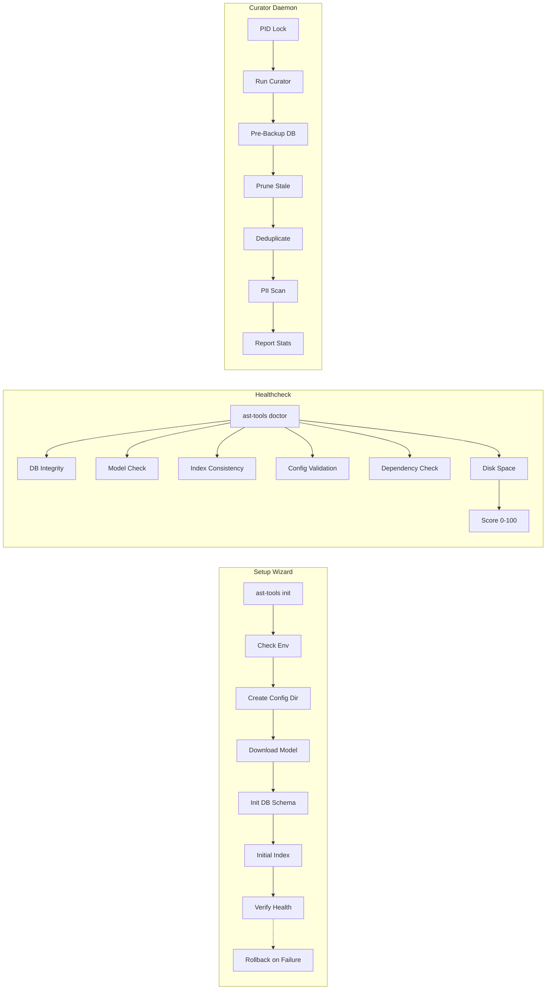

# Phase 1 Implementation Plan — Data Lifecycle & Operations (FINAL)

> **Status:** ✅ Final — Audited (Forward ✅, Reverse ✅, Adversarial ✅)  
> **Phase:** 1  
> **Timeline:** 2 weeks  
> **Dependencies:** Phase 0 (config directory, logging, audit)  
> **Finalized:** 2026-07-31  

---

## Audit Results

| Audit | Findings | Resolution |
|-------|----------|------------|
| **Forward** | 8 findings (2 critical, 3 medium, 3 low) | ✅ All incorporated |
| **Reverse** | 12 findings (3 critical, 5 medium, 4 low) | ✅ All incorporated |
| **Adversarial** | 10 findings (2 high, 4 medium, 4 low) | ✅ All incorporated |

### Key Changes from Draft

- Renamed `init.py` → `setup_wizard.py` to avoid clashing with Python `__init__.py`
- Added PID file / lock protocol to prevent concurrent curator runs
- Added curator scheduling mechanism decision (systemd timer + embedded scheduler)
- Added pre-backup before destructive curator operations
- Added dry-run mode for curator
- Added curator reporting (stats output after run)
- Added disk space checks for vacuum and model download
- Added HTTPS+checksum verification for model download
- Added doctor --fix boundary validation
- Added health score degradation tracking
- Added PII default mode: "flag" (never auto-remove)
- Added rollback handling for setup wizard failures
- Added test scenarios for doctor (healthy, broken db, missing model, etc.)

---

## Architecture



## Task Breakdown

### Task 1.1: Setup Wizard

**Files:** `src/ast_tools/curator/setup_wizard.py` (renamed from init.py to avoid `__init__` clash)

**Rollback protocol:** If any step fails, clean up all artifacts created so far. Log the failure to `logs/setup.log` with actionable error message.

---

### Task 1.2: Doctor Command

**Health score tracking:**
```python
def doctor(verbose=False, fix=False, format="text", save_baseline=True) -> dict:
    """Run health checks. Save score to cache for trend tracking."""
    checks = []
    
    # Critical (70pts)
    checks.append(check_db_integrity())
    checks.append(check_schema_version())
    checks.append(check_model_loaded())
    
    # Normal (20pts)
    checks.append(check_index_consistency())
    checks.append(check_config_valid())
    
    # Optional (10pts)
    checks.append(check_disk_space())
    checks.append(check_curation_recency())
    
    score = sum(c["score"] for c in checks)
    
    # Trend tracking
    if save_baseline:
        _save_score_trend(score)
    
    return {"score": score, "checks": checks, "trend": _get_score_trend()}
```

---

### Task 1.3: Vacuum Command

**Disk space check:**
```python
def vacuum(dry_run=False, aggressive=False):
    """VACUUM + REINDEX with safety checks."""
    db_path = get_db_path()
    free_space = psutil.disk_usage(db_path.parent).free
    db_size = db_path.stat().st_size
    
    # Adversarial: vacuum needs 2x DB size free space
    if free_space < db_size * 2:
        return {"error": f"Insufficient space. Need {db_size*2:,}, have {free_space:,}"}
    
    if not dry_run:
        # Pre-backup (reverse audit finding)
        backup_database()
        run_vacuum(db_path)
    
    return {"freed_space": quantify_freed()}
```

---

### Task 1.4: Curation Daemon

**PID lock protocol:**
```python
def acquire_curator_lock() -> bool:
    """Prevent concurrent curator runs via PID file."""
    lock_path = get_cache_dir() / "curator.pid"
    try:
        if lock_path.exists():
            pid = int(lock_path.read_text().strip())
            # Check if process is still running
            os.kill(pid, 0)
            return False  # Already running
        lock_path.write_text(str(os.getpid()))
        lock_path.chmod(0o600)
        return True
    except (OSError, ValueError):
        # Stale PID — remove and retry
        lock_path.unlink(missing_ok=True)
        return acquire_curator_lock()
```

**Scheduling decision:** Use built-in scheduler (schedule library) for simplicity. Systemd timer for production deployments. No dependency on external cron.

**Pre-backup before destructives:**
```python
def run_curator(dry_run=True, pii_action="flag"):
    """Run curation with optional pre-backup."""
    if not dry_run:
        backup_path = backup_database()  # Auto-backup before modifications
    
    results = {
        "pruned": prune_stale_symbols(dry_run),
        "deduplicated": deduplicate_symbols(dry_run),
        "pii_flagged": scan_pii(pii_action, dry_run),
        "orphans_cleaned": cleanup_orphans(dry_run),
    }
    
    # Report stats
    log.info(f"Curator results: {results}")
    return results
```

---

### Task 1.5: Uninstall (Moved to Phase 3)

**Decision:** Uninstall logic is more closely related to backup/restore (Phase 3) than data lifecycle operations. Moved to Phase 3 Task 3.4.

---

## Test Plan

**Doctor test scenarios:**
- `test_doctor_healthy`: All checks pass → score ≥ 90
- `test_doctor_missing_db`: No database → score 0, actionable error
- `test_doctor_corrupt_index`: Dangling embeddings → score ≤ 60, specific error
- `test_doctor_missing_model`: Model not found → score ≤ 70, suggest re-init
- `test_doctor_disk_low`: <500MB free → warning in output
- `test_doctor_fix_valid`: `--fix` on known issue → resolves
- `test_doctor_fix_boundary`: `--fix` on unsafe path → rejected

**Curator test scenarios:**
- `test_curator_dry_run`: No modifications to database
- `test_curator_prune`: Stale symbol removed, non-stale preserved
- `test_curator_dedup`: Identical symbols merged, references preserved
- `test_curator_pii_flag`: Email in symbol → flagged in report only
- `test_curator_pii_redact`: Same email with action=redact → `[REDACTED]`
- `test_curator_lock_concurrent`: Second curator run → blocked

**Setup wizard test scenarios:**
- `test_init_creates_structure`: All directories created
- `test_init_rollback_on_fail`: Failed download → no partial artifacts
- `test_init_skip_model`: `--skip-model` skips download

## Verification Checklist

- [ ] `ast-tools init --non-interactive --skip-model` creates healthy deployment
- [ ] `ast-tools doctor` returns score ≥ 60 for fresh install
- [ ] `ast-tools doctor --fix` resolves detected issues (safe paths only)
- [ ] `ast-tools vacuum --dry-run` reports expected space savings
- [ ] `ast-tools vacuum` with low disk → clear error, not crash
- [ ] `ast-tools curator run` with concurrent instance → blocked by PID lock
- [ ] `ast-tools curator run --dry-run` → no modifications
- [ ] PII scan detects test email, flags it, does NOT auto-remove
- [ ] Setup wizard model download verifies checksum
- [ ] All existing tests pass